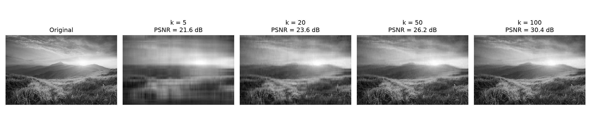
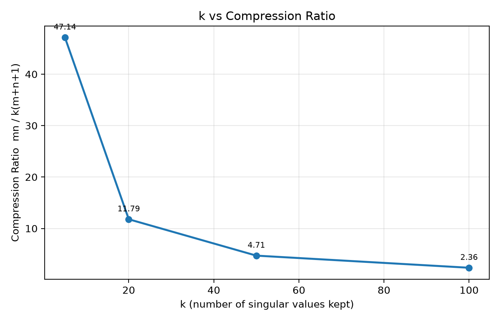
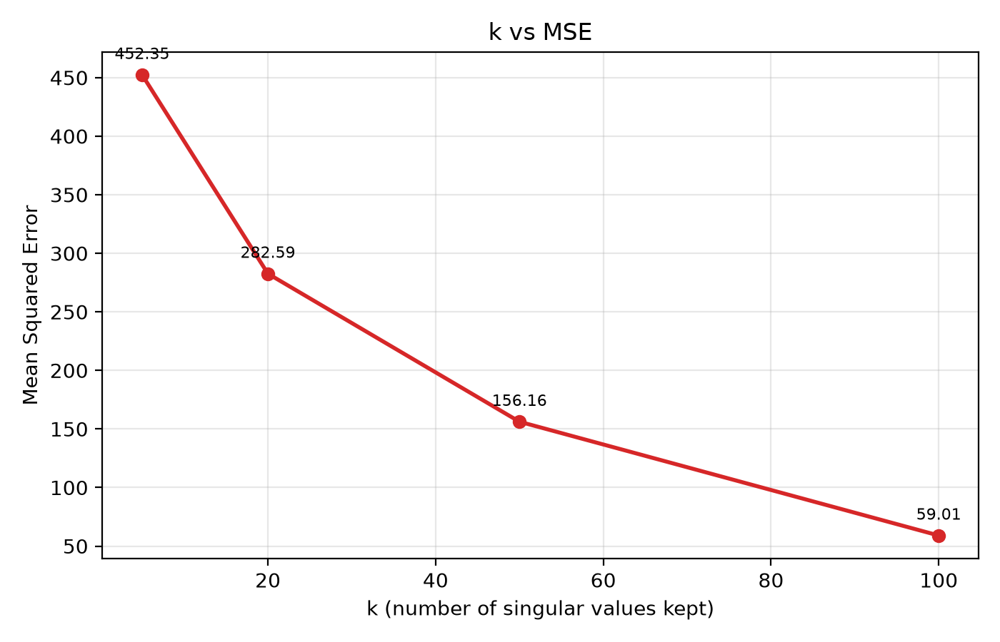
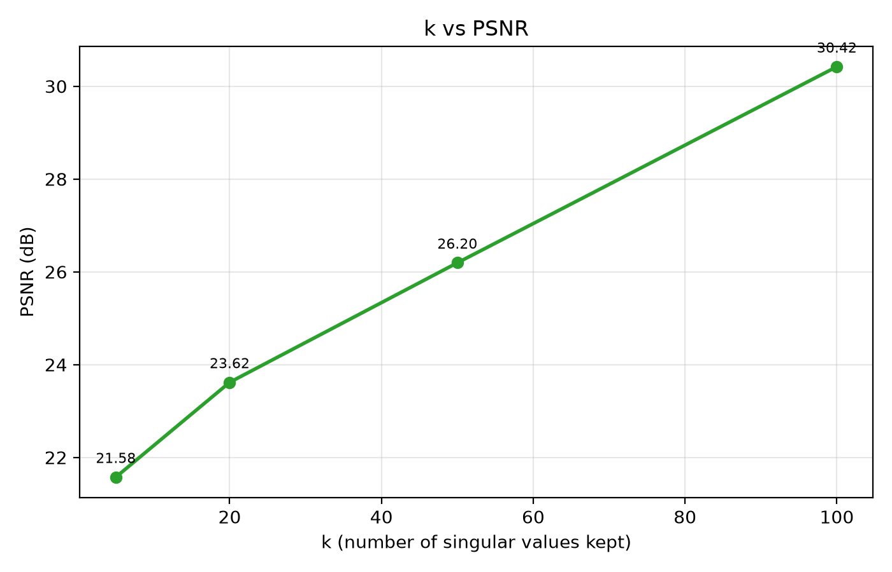

# SVD Image Compression

Lossy image compression using **Singular Value Decomposition (SVD)**, built with Python and NumPy. The project treats a grayscale image as a matrix, factorises it, keeps only the `k` most important components, and measures how much storage is saved against how much quality is lost.

> Course project: applying linear algebra (SVD and low-rank approximation) to a real-world problem.

---
## Overview

A grayscale image is just a grid of numbers. SVD splits that grid into a sum of simple, ranked layers. The first few layers carry most of the visual information; the later ones mostly carry fine detail and noise. By discarding the later layers we get a smaller representation that still looks like the original.

This project:

- Loads an image and converts it to a matrix.
- Computes its SVD.
- Reconstructs the image at several ranks `k` (default: 5, 20, 50, 100).
- Evaluates every reconstruction using storage size, compression ratio, MSE and PSNR.
- Produces graphs and a side-by-side visual comparison.

---

## The Concept

### 1. An image is a matrix

A grayscale image of height `m` and width `n` is an `m × n` matrix `A`, where each entry is a pixel intensity from `0` (black) to `255` (white).

### 2. Singular Value Decomposition

Any real matrix can be factorised as

```
A = U Σ Vᵀ
```

| Symbol | Shape | Meaning |
|--------|-------|---------|
| `U`  | `m × r` | Left singular vectors (orthonormal columns) |
| `Σ`  | `r × r` | Diagonal matrix of singular values `σ₁ ≥ σ₂ ≥ … ≥ σᵣ ≥ 0` |
| `Vᵀ` | `r × n` | Right singular vectors (orthonormal rows) |

where `r = min(m, n)`.

Equivalently, `A` is a sum of rank-1 layers:

```
A = σ₁ u₁ v₁ᵀ + σ₂ u₂ v₂ᵀ + … + σᵣ uᵣ vᵣᵀ
```

Each term is weighted by its singular value, so large `σᵢ` mean important layers.

### 3. Low-rank approximation

Keeping only the first `k` terms gives the **rank-k approximation**

```
Aₖ = Uₖ Σₖ Vₖᵀ
```

where `Uₖ` is the first `k` columns of `U`, `Σₖ` is the top-left `k × k` block of `Σ`, and `Vₖᵀ` is the first `k` rows of `Vᵀ`.

By the **Eckart–Young theorem**, `Aₖ` is the *best possible* rank-`k` approximation of `A` in both the Frobenius and spectral norms. No other rank-`k` matrix is closer to the original.

### 4. Why this compresses

Storing the full image needs `m × n` values. Storing the rank-`k` form needs only:

```
Uₖ : m·k values
Σₖ : k   values
Vₖ : n·k values
─────────────────
total = k(m + n + 1)
```

So the compression ratio is

```
CR = (m · n) / (k · (m + n + 1))
```

This is a real saving only while `k` is small enough that `k(m + n + 1) < m·n`, i.e. below the **break-even rank**:

```
k < (m · n) / (m + n + 1)
```

For a 512 × 512 image that threshold is about 255.8. Past that point the SVD form is larger than the raw matrix, so compression is pointless.

### 5. The trade-off

| `k` | Storage | Quality |
|-----|---------|---------|
| Small | Very small | Blurry, only broad shapes survive |
| Medium | Moderate | Most structure and edges recovered |
| Large | Approaches original | Near-identical to the original |

---

## Features

- Grayscale image loading and saving with Pillow
- SVD via `numpy.linalg.svd` (economy mode, `full_matrices=False`)
- Rank-`k` reconstruction for any list of `k` values
- Storage and compression-ratio analysis, including the break-even rank
- Quality metrics: **MSE** and **PSNR**
- Auto-generated plots: `k` vs compression ratio, MSE and PSNR
- Side-by-side comparison figure (original + every reconstruction)
- Results exported to `results.csv`
- Command-line options for input path, output folders and `k` values

---

## Project Structure

```
SVD-Image-Compression/
├── input/                  # put your image here (e.g. sample.jpg), not tracked
├── output/                 # reconstructed images (generated)
├── graphs/                 # plots and results.csv (generated)
├── src/
│   ├── image_utils.py      # load image -> matrix, save matrix -> image
│   ├── svd_compression.py  # SVD and rank-k reconstruction
│   ├── main.py             # compression pipeline
│   ├── metrics.py          # storage, compression ratio, MSE, PSNR
│   ├── visualization.py    # graphs and comparison figure
│   └── evaluate.py         # evaluation driver: table, CSV, plots
├── requirements.txt
└── README.md
```

### Module guide

| File | Responsibility |
|------|----------------|
| `image_utils.py` | `load_image(path)` opens an image, converts it to grayscale (`"L"` mode) and returns a `float64` matrix. `save_image(matrix, path)` clips values to `[0, 255]`, casts to `uint8` and writes the file. |
| `svd_compression.py` | `apply_svd(matrix)` returns `U, S, Vᵀ`. `reconstruct_image(U, S, VT, k)` builds `Uₖ Σₖ Vₖᵀ`. `compress_image(matrix, k)` is a one-call convenience wrapper. |
| `main.py` | Runs the pipeline: load, SVD, loop over `K_VALUES`, reconstruct and save `compressed_k{k}.png`. Skips any `k` larger than the number of singular values. |
| `metrics.py` | `original_size`, `compressed_size`, `compression_ratio`, `storage_saved_percent`, `break_even_rank`, `file_size_kb`, `mse`, `psnr`. |
| `visualization.py` | `plot_compression_ratio`, `plot_mse`, `plot_psnr`, `plot_comparison`. Uses the non-interactive `Agg` backend so it works without a display. |
| `evaluate.py` | Loads the original and each compressed PNG, computes all metrics, prints a table, writes `results.csv` and generates all figures. If a PNG is missing it rebuilds that reconstruction itself using the same clip and `uint8` conversion as `save_image`. |

### Pipeline

```
Input image
    │
    ▼
Grayscale matrix A (m × n)
    │
    ▼
SVD: A = U Σ Vᵀ
    │
    ▼
Keep top-k singular values
    │
    ▼
Aₖ = Uₖ Σₖ Vₖᵀ
    │
    ├──► Save compressed_k{k}.png          (main.py)
    │
    └──► MSE, PSNR, compression ratio,
         graphs, results.csv               (evaluate.py)
```

---

## Installation

**Requirements:** Python 3.8+

```bash
git clone https://github.com/chitniskedar/SVD-Image-Compression.git
cd SVD-Image-Compression

# optional but recommended
python -m venv venv
source venv/bin/activate        # Windows: venv\Scripts\activate

pip install -r requirements.txt
```

Dependencies: `numpy`, `Pillow`, `matplotlib`.

---

## Metrics Explained

### Compression ratio

```
CR = m·n / (k(m + n + 1))
```

How many times smaller the SVD representation is than the raw matrix. A value below 1 means the SVD form is *larger* than the original.

### Storage saved

```
saved % = (1 − k(m + n + 1) / (m·n)) × 100
```

Negative when `k` is past the break-even rank.

### MSE (Mean Squared Error)

```
MSE = (1 / mn) Σᵢⱼ (Aᵢⱼ − Aₖᵢⱼ)²
```

Average squared pixel difference. Lower is better; `0` means identical.

### PSNR (Peak Signal-to-Noise Ratio)

```
PSNR = 10 · log₁₀( 255² / MSE )   dB
```

A log-scale quality measure. Higher is better, and identical images give infinity. As a rough guide, above 40 dB is visually near-lossless, 30 to 40 dB is good, and below 20 dB is clearly degraded.

### Why two sizes are reported

`results.csv` contains both `svd_values_stored` (the theoretical count of numbers needed, `k(m+n+1)`) and `png_file_KB` (the actual file size on disk). They are different things: PNG applies its own lossless compression on top of the pixels, so file size on disk does not follow the SVD formula.

---
### What to expect

- **Compression ratio** falls as `k` grows (it is inversely proportional to `k`).
- **MSE** drops quickly at first, then flattens, because singular values decay fast for natural images.
- **PSNR** rises as `k` grows, with diminishing returns.
- Images with large smooth regions compress well at small `k`; highly textured images need a larger `k`.

---
 
## Results
 
Run on `input/sample.jpg` (612 × 384 grayscale, 235,008 values):
 
| k | Values stored | Compression ratio | Storage saved | MSE | PSNR (dB) | PNG size (KB) |
|---|---------------|-------------------|---------------|-----|-----------|---------------|
| 5   | 4,985  | 47.14× | 97.88% | 452.35 | 21.58 | 78.8 |
| 20  | 19,940 | 11.79× | 91.52% | 282.59 | 23.62 | 112.3 |
| 50  | 49,850 | 4.71×  | 78.79% | 156.17 | 26.20 | 130.2 |
| 100 | 99,700 | 2.36×  | 57.58% | 59.01  | 30.42 | 140.5 |
 
### Visual comparison
 

 
### Graphs
 
| Compression ratio | MSE | PSNR |
|---|---|---|
|  |  |  |

---

## Implementation Notes

- **Economy SVD.** `np.linalg.svd(matrix, full_matrices=False)` returns `U` as `m × r` and `Vᵀ` as `r × n` instead of full square matrices, which saves memory and time.
- **Clipping.** Reconstructed values can fall slightly below 0 or above 255, so `save_image` clips to `[0, 255]` before casting to `uint8`. `evaluate.py` applies the same transformation when it has to rebuild a reconstruction, so metrics always match the saved files.
- **Float precision.** Images are loaded as `float64` so the linear algebra is not affected by integer overflow or rounding.
- **Grayscale only.** Using a single channel keeps the maths to one matrix.
- **Headless plotting.** `matplotlib.use("Agg")` lets the scripts run on servers and in CI without a display.
- **Edge cases handled.** `k` larger than `min(m, n)` is skipped, and `psnr` returns `inf` when MSE is `0`.

---

## Limitations

- Works on **grayscale** images only.
- The saved PNGs are ordinary 8-bit images, so the *file size on disk is not reduced* by SVD. The compression here is measured in the number of values needed for `Uₖ, Σₖ, Vₖ`, not in bytes of the output file. A true compressed file format would need to store the factors themselves, ideally quantised.
- SVD compression is **not competitive with JPEG or other transform codecs** for general photos. It is a teaching tool for low-rank approximation.
- Runtime is roughly `O(mn · min(m, n))` for the full SVD, which is slow for very large images.
- Scripts depend on being run from `src/` because of the relative paths.

---

## Tech Stack

| Tool | Purpose |
|------|---------|
| Python 3 | Language |
| NumPy | Matrix operations and SVD |
| Pillow | Image I/O and grayscale conversion |
| Matplotlib | Graphs and comparison figures |

---

## Contributors

- **Kedar Chitnis**: [@chitniskedar](https://github.com/chitniskedar)
- **Venkata Sreeram**: [@hasithsreeram](https://github.com/hasithsreeram)

---